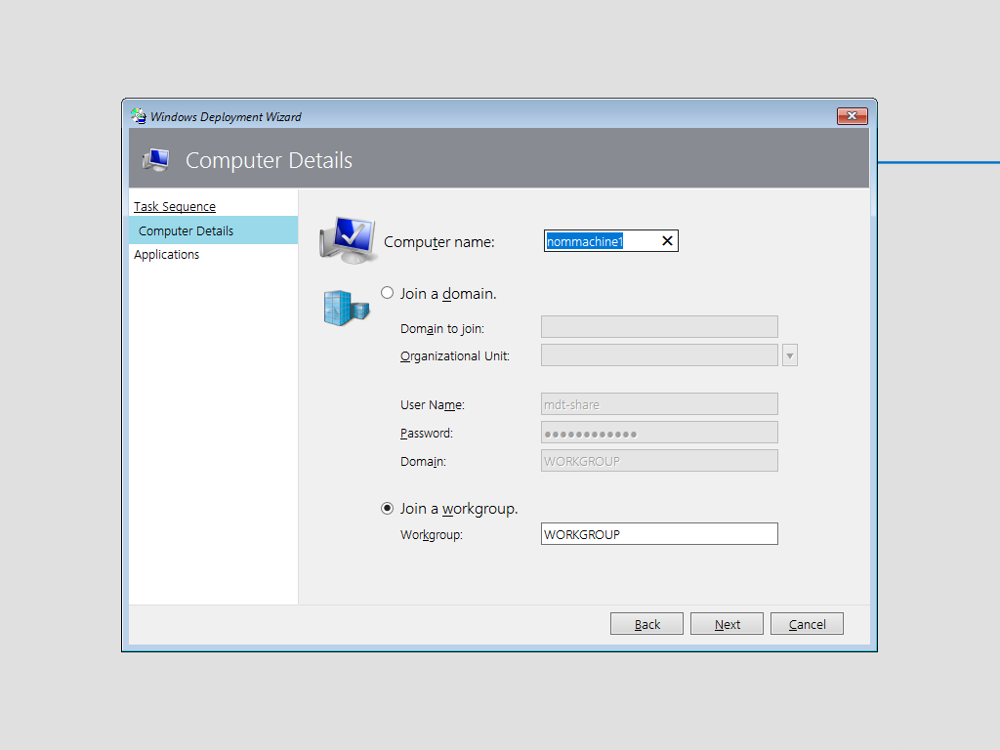

# mdt-ws-computername-glpi

From Microsoft Deployment Toolkit's Windows Deployment Wizard, get the computer name from its serial number using a web service installed on a GLPI server.

This PHP script have been created by Yoann LAMY under the terms of the [GNU General Public License v3](http://www.gnu.org/licenses/gpl.html).



### Installation

In Microsoft Deployment Toolkit, edit the file *\<DeployRoot\>\Control\CustomSettings.ini* to define the web service by specifying its URL (in this example : ``https://glpi.domain.com/``) :
  
```
[Settings]
Priority=GetComputerName,Default

[GetComputerName]
WebService=https://glpi.domain.com/ws_computername.php
Parameters=SerialNumber
Method=GET
OSDComputerName=name
```

And copy the PHP script *ws_computername.php* to the root of the GLPI server (in this example : ``https://glpi.domain.com/`` , assuming that the GLPI server is accessible from ``https://glpi.domain.com/glpi/``).
